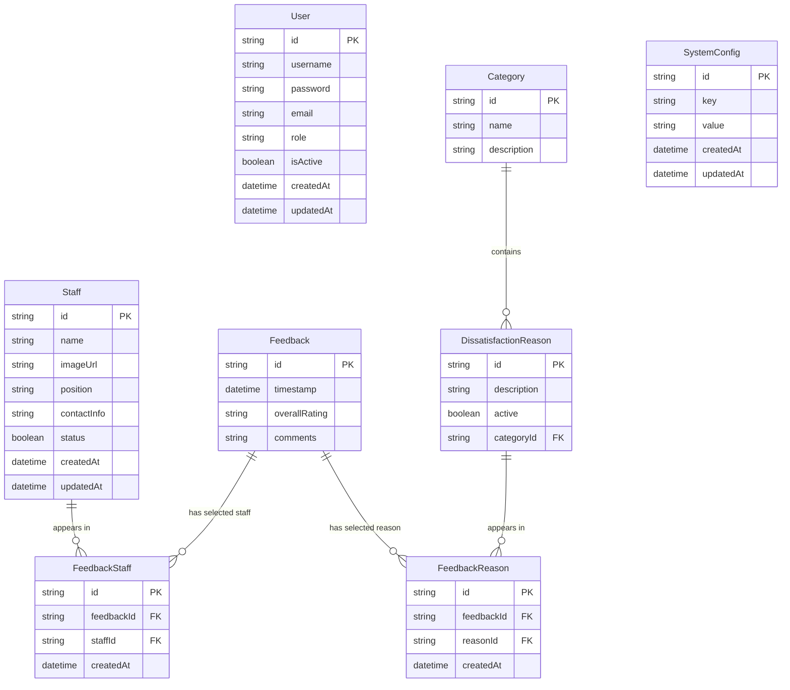

# Entity-Relationship Diagram (Current Implementation)

This document reflects the **actual Prisma schema and current application behavior**.

## Mermaid ERD

---

## Entity Purpose

### User
Stores admin users who can authenticate into the admin portal.

### Staff
Stores active/inactive staff members displayed in the positive feedback flow and used in reporting.

### Feedback
Stores the top-level customer submission record.
- `overallRating` is currently either:
  - `GOOD`
  - `NOT_SATISFIED`
- `comments` exists in the schema but is **not currently populated by the UI**.

### FeedbackStaff
Junction table linking a feedback record to a selected staff member.

### Category
Groups dissatisfaction reasons for display and reporting.

### DissatisfactionReason
Stores selectable dissatisfaction reasons used in the negative feedback flow.

### FeedbackReason
Junction table linking a feedback record to a selected dissatisfaction reason.

### SystemConfig
Stores configuration-style key/value records seeded into the database.
These values exist in the schema and seed data, but they are not yet fully wired to a settings UI.

---

## Relationship Descriptions

### 1. Feedback -> FeedbackStaff
- One `Feedback` record can be linked to zero or more `FeedbackStaff` records.
- In the current UI flow, the customer selects one staff member on the positive path.
- The schema supports association records via the junction table.

### 2. Staff -> FeedbackStaff
- One `Staff` member can appear in many `FeedbackStaff` records.
- This relationship powers staff selection analytics.

### 3. Feedback -> FeedbackReason
- One `Feedback` record can be linked to zero or more `FeedbackReason` records.
- In the current UI flow, the customer selects one dissatisfaction reason on the negative path.

### 4. DissatisfactionReason -> FeedbackReason
- One dissatisfaction reason can appear in many `FeedbackReason` records.
- This relationship powers dissatisfaction summary and comparison reporting.

### 5. Category -> DissatisfactionReason
- One category can contain many dissatisfaction reasons.
- Each dissatisfaction reason belongs to one category.

---

## Current Data Flow Summary

### Positive flow
1. Create `Feedback` with `overallRating = GOOD`
2. Select one staff member
3. Create `FeedbackStaff` linking the feedback and staff IDs

### Negative flow
1. Create `Feedback` with `overallRating = NOT_SATISFIED`
2. Select one dissatisfaction reason
3. Create `FeedbackReason` linking the feedback and reason IDs

---

## Current Notes

- `Feedback.comments` is reserved in the schema but currently unused by the implemented customer UI.
- `SystemConfig` exists, but customer timeout behavior in the UI is currently hardcoded to 10 seconds.
- The ERD reflects the schema; the current user experience uses a narrower subset of that model than the schema could support in future versions.
