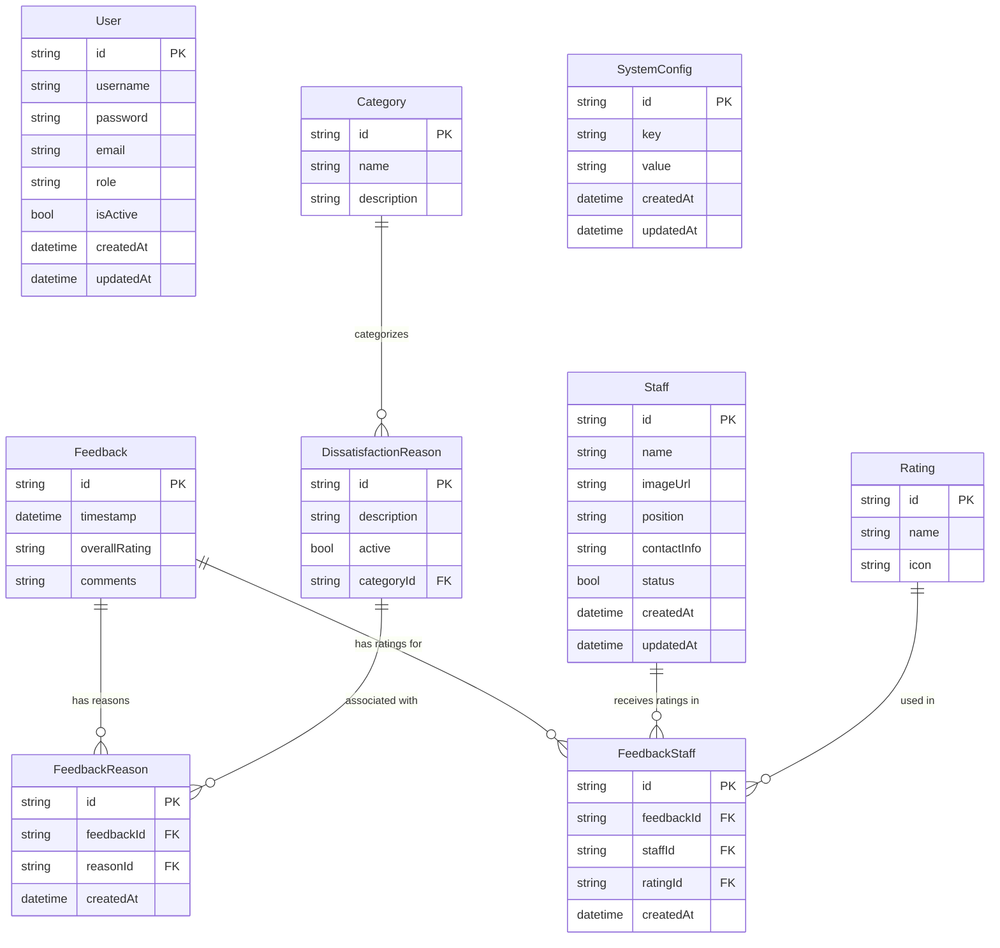

# Entity-Relationship Diagram (Mermaid): Customer Satisfaction Feedback System

## Relationship Descriptions

1. **Feedback to FeedbackStaff**: One-to-Many
   - One feedback entry can have multiple staff ratings
   - Each FeedbackStaff entry belongs to exactly one Feedback

2. **Staff to FeedbackStaff**: One-to-Many
   - One staff member can be rated in multiple feedback entries
   - Each FeedbackStaff entry references exactly one Staff member

3. **Rating to FeedbackStaff**: One-to-Many
   - One rating type (Heart, Like, Wow, Angry) can be used in many FeedbackStaff entries
   - Each FeedbackStaff entry has exactly one Rating

4. **Feedback to FeedbackReason**: One-to-Many
   - One feedback entry can have multiple dissatisfaction reasons
   - Each FeedbackReason entry belongs to exactly one Feedback

5. **DissatisfactionReason to FeedbackReason**: One-to-Many
   - One dissatisfaction reason can be associated with multiple feedback entries
   - Each FeedbackReason entry references exactly one DissatisfactionReason

6. **Category to DissatisfactionReason**: One-to-Many
   - One category can contain multiple dissatisfaction reasons
   - Each dissatisfaction reason belongs to exactly one category 