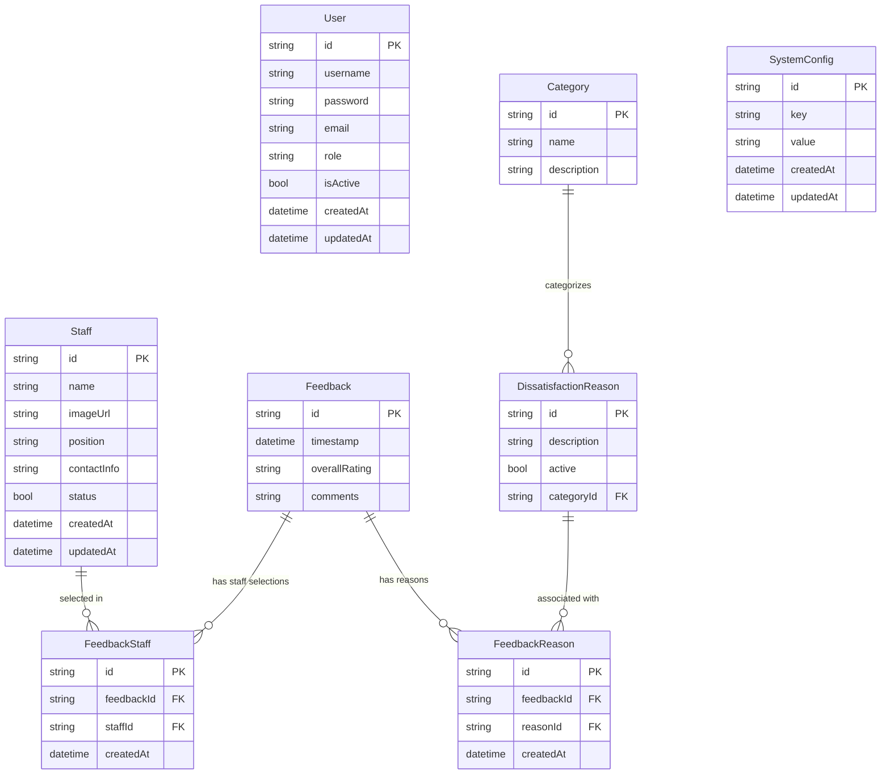

# Customer Satisfaction Feedback System

A modern web-based platform for collecting and analyzing customer satisfaction feedback in retail environments. Built with Next.js, TypeScript, Prisma, and Tailwind CSS.

---

## Features

- **Customer Feedback Portal**: Simple, touch-optimized interface for customers to rate their experience and select staff.
- **Admin Portal**: Secure management of staff, dissatisfaction reasons, and system configuration.
- **Analytics & Reporting**: Visual dashboards for staff selection trends and dissatisfaction analysis.
- **Session Timeout**: Automatic reset for kiosk use.
- **Authentication**: NextAuth.js-based admin login and session management.
- **Dockerized Deployment**: Production-ready with MySQL and Nginx support.

---

## Architecture & Tech Stack

- **Frontend & Backend**: Next.js (App Router, SSR)
- **Language**: TypeScript (strict mode)
- **Database**: MySQL (via Prisma ORM)
- **Authentication**: NextAuth.js
- **Styling**: Tailwind CSS
- **Containerization**: Docker & Docker Compose
- **State Management**: React Context API
- **Testing**: (Planned) Unit and component tests

---

## Directory Structure

```
src/
├── app/                 # App Router pages and layouts (customer & admin portals)
│   ├── api/             # API routes
│   ├── admin/           # Admin portal (login, dashboard, error)
│   ├── rate-staff/      # Staff selection flow
│   ├── dissatisfaction-reasons/ # Dissatisfaction flow
│   └── thank-you/       # Thank you page
├── components/          # Reusable UI components
│   └── ui/              # Base UI (charts, shimmer, etc.)
├── lib/                 # Utility functions and configurations
│   ├── db.ts            # Prisma client
│   ├── auth.ts          # Auth logic
│   └── staff-selection.ts # Staff selection logic
├── server/              # Server-side code (tRPC, etc.)
├── types/               # TypeScript type definitions
├── hooks/               # Custom React hooks
├── utils/               # Helper functions
├── styles/              # Custom styles
```

---

## Environment Variables

Create a `.env` or `.env.production` file in the project root with the following variables:

```
# Database
DATABASE_URL=mysql://user:password@db:3306/customer_feedback

# NextAuth.js
NEXTAUTH_URL=https://your-domain.com
NEXTAUTH_SECRET=your-nextauth-secret-key-at-least-32-chars

# Upload storage
UPLOAD_DIR=/app/uploads

# App settings
SESSION_TIMEOUT=10000

# MySQL (for docker-compose-database.yml)
MYSQL_DATABASE=customer_feedback
MYSQL_USER=user
MYSQL_PASSWORD=password
MYSQL_ROOT_PASSWORD=secure-root-password
```

---

## Getting Started (Development)

```bash
npm install
npm run dev
```

- App runs at http://localhost:3000
- Requires a running MySQL instance (see Docker setup below)

---

## Docker Deployment

### Prerequisites
- Docker & Docker Compose
- (Optional) Domain name & SSL certificates for production

### Setup

1. **Clone the repository:**
   ```bash
   git clone [repository-url]
   cd customer-feedback
   ```
2. **Configure environment:**
   - Copy and edit `.env.production` as above.
3. **Start services:**
   ```bash
   docker-compose -f docker-compose-database.yml up -d
   docker-compose -f docker-compose-app.yml up -d
   ```
4. **Initialize the database:**
   ```bash
   docker-compose -f docker-compose-app.yml exec app npx prisma migrate deploy
   docker-compose -f docker-compose-app.yml exec app npx prisma db seed
   ```

### Maintenance
- View logs: `docker-compose -f docker-compose-app.yml logs -f`
- Restart: `docker-compose -f docker-compose-app.yml restart`
- Update: `git pull && docker-compose -f docker-compose-app.yml build app && docker-compose -f docker-compose-app.yml up -d`
- Backup DB: `docker-compose -f docker-compose-database.yml exec db mysqldump -u root -p customer_feedback > backup_$(date +%Y%m%d).sql`
- Restore DB: `docker-compose -f docker-compose-database.yml exec -T db mysql -u root -p customer_feedback < backup_file.sql`

---

## Database Schema (ERD)

> See [`ERD.md`](ERD.md) for full details.



---

## Security & Best Practices

- Use strong, unique passwords for all secrets and DB users
- Regularly update Docker images and dependencies
- Validate all user input (Zod schemas)
- Use HTTPS in production
- Monitor logs and set up automated DB backups
- Never commit `.env` files or secrets to version control

---

## References & Documentation

- [Product Requirements Document (PRD.md)](PRD.md)
- [Entity-Relationship Diagram (ERD.md)](ERD.md)
- [Prisma Schema](prisma/schema.prisma)
- [Database Setup Guide](DATABASE_SETUP.md)

---

For questions or contributions, please open an issue or pull request.
